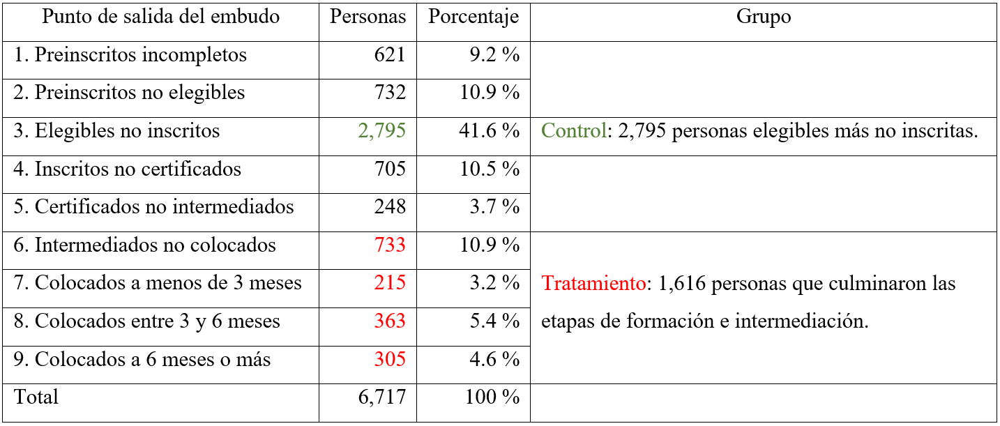
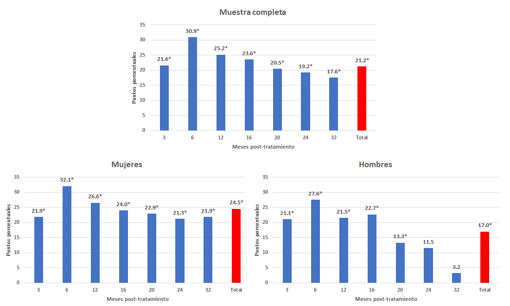
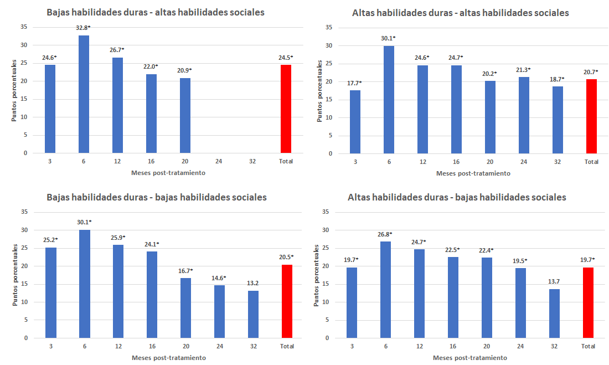

```{r setup, include=FALSE}
# This is the recommended set up for flipbooks
# you might think about setting cache to TRUE as you gain practice --- building flipbooks from scratch can be time consuming
options(width = 70)
knitr::opts_chunk$set(
  dev.args = list(bg = 'transparent'),
  fig.width = 12, message = TRUE,
  warning = FALSE, comment = "", cache = TRUE, fig.retina = 3
)
knitr::opts_knit$set(global.par = TRUE)
Sys.setenv(`_R_S3_METHOD_REGISTRATION_NOTE_OVERWRITES_` = "false")
#remotes::install_github("luukvdmeer/sfnetworks")
#remotes::install_github("EvaMaeRey/flipbookr")
#remotes::install_github("rlesur/klippy")
#devtools::install_github("gadenbuie/xaringanExtra")
library(flipbookr)
library(xaringanthemer)
library(tidyverse)
library(klippy)
library(xaringanExtra)
library(gt); library(knitr); library(kableExtra); library(tibble)
library(summarytools)
```

<style>
.my-logo-right {
    content: "";
    position: absolute;
    left: 400px;
    height: 400px;
    width: 400px;
    background-repeat: no-repeat;
    background-size: contain;
    background-image: url("qr.png");
}

.hbody {
  line-height: .85;
}

body {
  text-align: justify;
}

h1{
  margin-top: -1px;
  margin-bottom: -3px;
}

.small-code pre{
  margin-bottom: -10px;
  
}  

.medium-code pre{
  margin-bottom: 2px;
  
}

</style>

```{r xaringan-scribble, echo=FALSE}
xaringanExtra::use_scribble()
```

```{r xaringanExtra-clipboard, echo=FALSE}
htmltools::tagList(
  xaringanExtra::use_clipboard(
    button_text = "<i class=\"fa fa-clipboard\"></i>",
   success_text = "<i class=\"fa fa-check\" style=\"color: #90BE6D\"></i>",
   error_text = "<i class=\"fa fa-times-circle\" style=\"color: #F94144\"></i>"
 ),
 rmarkdown::html_dependency_font_awesome()
)
```

```{r xaringan-extra-styles, echo=FALSE}
xaringanExtra::use_extra_styles(
  hover_code_line = TRUE,         #<<
  mute_unhighlighted_code = TRUE  #<<
)
```
<font size = "5">

<br>
<br>
<br>

#<div class="my-logo-right"></div> 
Link slides en formato [html](https://gusgarciacruz.github.io/Presentations/BIS/PresentacionComfama.html)

Link slides en formato [PDF](https://gusgarciacruz.github.io/Presentations/BIS/PresentacionComfama.pdf)

---
# <span style="font-size:80%">Outline</span>

- <span style="font-size:150%">[<span style="color:black">Qué es un Bono de Impacto Social (BIS)?](#bis)</span> <br>

- <span style="font-size:150%">[<span style="color:black">BIS1: Empleando Futuro](#ef)</span><br>

- <span style="font-size:150%">[<span style="color:black">Datos y variable de resultado](#datos)</span><br>

- <span style="font-size:150%">[<span style="color:black">Integrantes de los grupos de control y tratamiento](#grupos)</span><br>

- <span style="font-size:150%">[<span style="color:black">Modelo de Diferencias en Diferencias (Callaway y SantAnna (2021))](#DD)</span><br>

- <span style="font-size:150%">[<span style="color:black">Efectos de Empleando Futuro sobre la formalidad](#resultados1)</span><br>

- <span style="font-size:150%">[<span style="color:black">Efectos de Empleando Futuro por tipo de formación](#resultados1)</span>
 
---
name: bis
# <span style="font-size:80%">Qué es un Bono de Impacto Social (BIS)?</span>
<spam style="font-size:110%">

- Los Bonos de Impacto Social (BIS) son un nuevo mecanismo para financiar y estructurar programas de intervención social

- Se originaron en el año 2010 y para mediados de 2017 existían más de 60 proyectos afines en 15 países de ingreso alto en el mundo 

- Los BIS han demostrado ser un buen mecanismo para:
<p style="margin-bottom: -0.8em">
 - La innovación y flexibilidad
 - La integración de múltiples actores frente a problemáticas sociales
 - La redistribución del riesgo entre los actores
 - El acceso a capital privado
 - La ampliación de la oferta de proveedores de servicio

- Por estas razones y por su creciente implementación se ha creado la necesidad de medir el **impacto** de estas intervenciones sobre los participantes

- BIS en Colombia:
<p style="margin-bottom: -0.8em">
 - Empleando Futuro: Bogotá, Cali y Pereira - junio 2017 y diciembre 2018
 - Cali progresa con empleo: Cali - abril 2019 y diciembre 2020
 - Crecemos con Empleo y Oportunidades (CREO) Comfama: Área metropolitana de Medellín - 2021
 - Creo Inversor: Bogotá, Medellín y Barranquilla - 2021

---
name: ef
# <span style="font-size:80%">Empleando Futuro</span>
<spam style="font-size:120%">

- **Empleando Futuro** es el primer BIS puesto en marcha en un país de ingreso medio como Colombia
<p style="margin-bottom: -.2em">
- **Empleando Futuro** financió la formación y búsqueda de empleo de personas vulnerables y desempleadas
<p style="margin-bottom: -0.8em">
 - La implementación fue entre <span style="color:blue">junio de 2017 y diciembre 2018</span>
 - Se llevó acabo en: <span style="color:blue">Bogotá, Cali y Pereira</span>
 - Apoyó la formación para el empleo, como <span style="color:blue">formación profesional, apoyo psicosocial y servicios de intermediación laboral
 - El programa ofrecía entre <span style="color:blue">100 y 300 horas de formación en habilidades sociales y duras</span>
 - Resultados: <span style="color:blue">empleo formal</span> y <span style="color:blue">duración de 3 y 6 meses en el empleo formal</span>

- El programa iba dirigido a personas:
<p style="margin-bottom: -0.8em">
 - Sin empleo formal al inicio del programa
 - Con edades comprendidas entre los 18 y los 40 años
 - Que obtuvieran una puntuación inferior a 41.74 en el Sistema de Selección Benéfica para Programas Sociales (SISBEN) o estaban inscritos en la Red Unidos, o víctimas del desplazamiento debido al conflicto
 
---
name: datos
# <span style="font-size:80%">Datos y variable de resultado</span>
<spam style="font-size:120%">

```{r, echo=FALSE, out.width="90%",fig.align='center'}

```

---
name: grupos
# <span style="font-size:80%">Integrantes de los grupos de control y tratamiento</span>
<spam style="font-size:120%">

```{r, echo=FALSE, out.width="90%",fig.align='center'}

```

---
name: grupos
# <span style="font-size:80%">Integrantes de los grupos de control y tratamiento</span>
<spam style="font-size:120%">

```{r, echo=FALSE, out.width="100%",fig.align='center'}

```

---
name: DD
# <span style="font-size:80%">Modelo de Diferencias en Diferencias (Callaway y SantAnna (2021))</span>
<spam style="font-size:120%">

```{r, echo=FALSE, out.width="80%",fig.align='center'}

```

---
name: resultados1
# <span style="font-size:80%">Efectos de Empleando Futuro sobre la formalidad</span>

```{r, echo=FALSE, out.width="85%",fig.align='center'}

```
<p style="margin-bottom: -0.8em">
<spam style="font-size:80%">\* representa estadísticamente significante al 5%

---
name: resultados2
# <span style="font-size:80%">Efectos de Empleando Futuro por tipo de formación</span>
<spam style="font-size:80%">

- Los operadore ofrecieron entre 100 y 300 horas de formación en habilidades sociales (<span style="color:blue">mediana 50h</span>) y duras (<span style="color:blue">mediana 70h</span>)
- <span style="color:blue">Cursos en habilidades duras</span>: sistemas informáticos básicos, atención al cliente y módulos de auxiliar administrativo, entre otros
- <span style="color:blue">Curso en habilidades sociales</span>: habilidades de comunicación, habilidades relacionales y gestión de conflictos, entre otros

```{r, echo=FALSE, out.width="80%",fig.align='center'}

```