```{r setup, include=FALSE}
# This is the recommended set up for flipbooks
# you might think about setting cache to TRUE as you gain practice --- building flipbooks from scratch can be time consuming
options(width = 70)
knitr::opts_chunk$set(
  dev.args = list(bg = 'transparent'),
  fig.width = 12, message = TRUE,
  warning = FALSE, comment = "", cache = TRUE, fig.retina = 3
)
knitr::opts_knit$set(global.par = TRUE)
Sys.setenv(`_R_S3_METHOD_REGISTRATION_NOTE_OVERWRITES_` = "false")
#remotes::install_github("luukvdmeer/sfnetworks")
#remotes::install_github("EvaMaeRey/flipbookr")
#remotes::install_github("rlesur/klippy")
#devtools::install_github("gadenbuie/xaringanExtra")
library(flipbookr)
library(xaringanthemer)
library(tidyverse)
library(klippy)
library(xaringanExtra)
library(gt); library(knitr); library(kableExtra); library(tibble)
library(summarytools)
```

<style>
.my-logo-right {
    content: "";
    position: absolute;
    left: 400px;
    height: 400px;
    width: 400px;
    background-repeat: no-repeat;
    background-size: contain;
    background-image: url("qr.png");
}

.hbody {
  line-height: .85;
}

body {
  text-align: justify;
}

h1{
  margin-top: -1px;
  margin-bottom: -3px;
}

.small-code pre{
  margin-bottom: -10px;
  
}  

.medium-code pre{
  margin-bottom: 2px;
  
}

</style>

```{r xaringan-scribble, echo=FALSE}
xaringanExtra::use_scribble()
```

```{r xaringanExtra-clipboard, echo=FALSE}
htmltools::tagList(
  xaringanExtra::use_clipboard(
    button_text = "<i class=\"fa fa-clipboard\"></i>",
   success_text = "<i class=\"fa fa-check\" style=\"color: #90BE6D\"></i>",
   error_text = "<i class=\"fa fa-times-circle\" style=\"color: #F94144\"></i>"
 ),
 rmarkdown::html_dependency_font_awesome()
)
```

```{r xaringan-extra-styles, echo=FALSE}
xaringanExtra::use_extra_styles(
  hover_code_line = TRUE,         #<<
  mute_unhighlighted_code = TRUE  #<<
)
```
# <span style="font-size:80%">Outline</span>

- <span style="font-size:150%">[<span style="color:black">Motivation](#motivation)</span> <br>

- <span style="font-size:150%">[<span style="color:black">Contribution](#contribution)</span><br>

- <span style="font-size:150%">[<span style="color:black">Relevant literature](#lite)</span><br>

- <span style="font-size:150%">[<span style="color:black">Data and descriptive evidence](#data)</span><br>

- <span style="font-size:150%">[<span style="color:black">Econometric model](#model)</span><br>

- <span style="font-size:150%">[<span style="color:black">Results](#results)</span><br>

- <span style="font-size:150%">[<span style="color:black">Conclusions](#conclusions)</span>

---
name: motivation
# <span style="font-size:80%">Motivation</span>
<spam style="font-size:110%">

- Many developing countries are characterized by the prevalence of <span style="color:blue">housing informality</span>, <span style="color:blue">labor informality</span> and <span style="color:blue">informality of transport

- <span style="color:blue">This triple informality in housing, employment and transport is an important factor driving the low levels in productivity and wellbeing observed in many cities in developing countries</span> (Vargas et al., 2017; OECD, 2018; Ferreyra and Roberts, 2018; Azunre et al, 2021) 

- <span style="color:blue">Housing and labor informality</span> are the phenomena with <span style="color:blue">the highest incidence</span> at the urban level and they are <span style="color:blue">closely related to socioeconomic indicators such as poverty, inequality, quality of life</span> and, in general, <span style="color:blue">the development of cities and their productivity</span> (UN-Habitat, 2016):

<br>

```{r, echo=FALSE, out.width="40%",fig.align='center'}
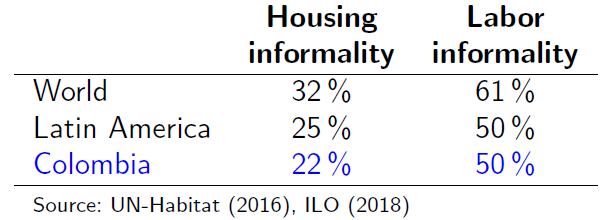
```

---
# <span style="font-size:80%">Motivation</span>
<spam style="font-size:120%">

- The cities in developing countries are characterized by the existent of areas hosting low-income workers living in precarious conditions 

- <span style="color:blue">These lower incomes might induce people to live in informal settlements, so that economic vulnerability and precarious working conditions may be within the causes of the emergence of informal housing</span> (Lombard and Mitlin, 2020) 

- <span style="color:blue">The precarious working conditions along with higher restrictions to access to the financial system that face informal workers are thought to be important mechanisms that explain the spatial choice of housing and its characteristics</span> (Vargas et al., 2017)

---
name: contribution
# <span style="font-size:80%">Contribution</span>
<spam style="font-size:120%">

- Despite the extensive literature on both housing informality and labor informality, <span style="color:blue">there is a lack of evidence on the relationship between these two phenomena in space</span>

- This paper aims to offer <span style="color:blue">new evidence on the links between precarious housing conditions (informal housing) and limited access to quality employment (labor informality), considering the relationship and spatial dimension of these two phenomena</span>

- Using data at the intra-urban level in Medellin (Colombia), we identified the effect of labor informality on housing informality through <span style="color:blue">spatial simultaneous equation models</span>, which take into account the relationship between informal housing and labor informality and the spatial dependence

---
name: lite
# <span style="font-size:80%">Relevant literature</span>
<spam style="font-size:110%">

Several studies focus on analyzing the determinants of housing informality and labor informality separately, forgetting the interdependence between them

<span style="color:blue">Among the few studies that simultaneously analyze these phenomena, they agree that precarious working conditions may be within the causes of precarious housing conditions</span>

**<span style="color:blue">Determinants of housing informality</span>**
<p style="margin-bottom: -1em">
- UN-Habitat (2013): lag in infrastructure
- Inostroza et al. (2013): urban growth
- <span style="color:blue">Bonet et al. (2016): labor informality</span>
- <span style="color:blue">Posada and Moreno (2019): labor informality, structure of the cities and price of land</span>
- Posada (2018): population growth

<p style="margin-bottom: 2em">

**<span style="color:blue">Determinants of labor informality</span>**
<p style="margin-bottom: -1em">
- Boisjoly et al. (2017): public transport
- Del Carpio and Patrick (2020): growth of cities
- Gutierrez (2021): inequality
- Lombard et al. (2021): level of income

---
name: data
#  <span style="font-size:80%">Data and descriptive evidence</span>
<spam style="font-size:80%">

- Population: 2.6 millions (Colombia: 48 millions, Bogotá: 8 millions)
- Area: 380 $km^2$ (Colombia: 1,141,748 $km^2$)
- <span style="color:blue">Density: 6749 $km^2$ (Bogotá: 4531 $km^2$)
- Unemployment: 8.6% (Colombia: 9.2%)
- <span style="color:blue">Housing informality: 7% (Colombia: 22%)
- <span style="color:blue">Labor informality: 44% (Colombia: 50%)
- Administrative division: 16 communes and 243 neighborhoods 


<center><spam style="font-size:90%">**Figure 1. Study area: Medellín**
```{r, echo=FALSE, out.width="60%",fig.align='center'}
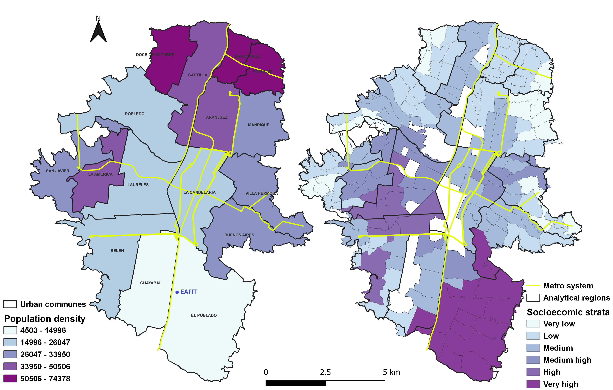
```

---
#  <span style="font-size:80%">Data and descriptive evidence</span>
<spam style="font-size:110%">

- The data used in this paper came from <span style="color:blue">the Quality of Life Survey (QLS)</span> for Medellín in 2017

<p style="margin-bottom: 1.5em">

- This cross-section survey contains individual-level information on household characteristics, demographics, education, social security, labor market, and indicators of poverty and socioeconomic conditions

<p style="margin-bottom: 1.5em">

- The sample includes a total of <span style="color:blue">42806</span> individuals (<span style="color:blue">12205</span> households)

---
#  <span style="font-size:80%">Data and descriptive evidence</span>
<spam style="font-size:90%">

- Our spatial unit of analysis are the analytical regions, which are homogeneous regions that are defined in terms of (Duque et al., 2012):
<p style="margin-bottom: -1em">
	- neighborhood limits
	- socioeconomic characteristics
	- each unit contains at least 100 household
	
- These analytical regions are calculated using the Max-p-regions technique (Duque et al., 2012), which is a technique to aggregation of areas into a maximum number of homogeneous regions that guarantees statistical representativeness and minimizes intraregional heterogeneity 

- We have <span style="color:blue">176 urban analytical regions</span> (average area: 0.521 $km^2$)

<center><spam style="font-size:90%">**Figure 2. Analytic regions (176) and neighborhoods (243)**
```{r, echo=FALSE, out.width="46%",fig.align='center'}
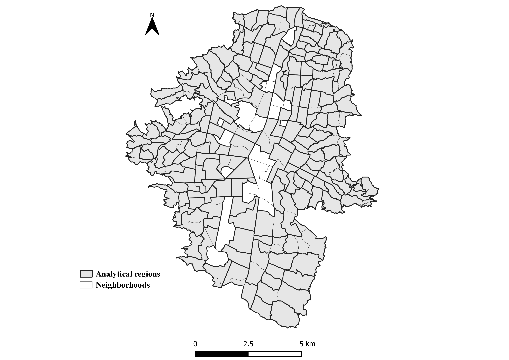
```

---
#  <span style="font-size:80%">Data and descriptive evidence</span>
<spam style="font-size:90%">

- <span style="color:blue">Housing informality</span><br>
A dwelling is considered informal if it has at least one of the following conditions (UN-Habitat, 2003):
<p style="margin-bottom: -1em">
  - walls that are not made of durable materials
  - overcrowding
  - lack of aqueduct
  - toilet not connected to the aqueduct

- <span style="color:blue">Labor informality</span><br>
Informal workers are those employees who do not contribute to the social security system: health and pension

<center><spam style="font-size:90%">**Figure 3. Housing informality and labor informality**
```{r, echo=FALSE, out.width="55%",fig.align='center'}
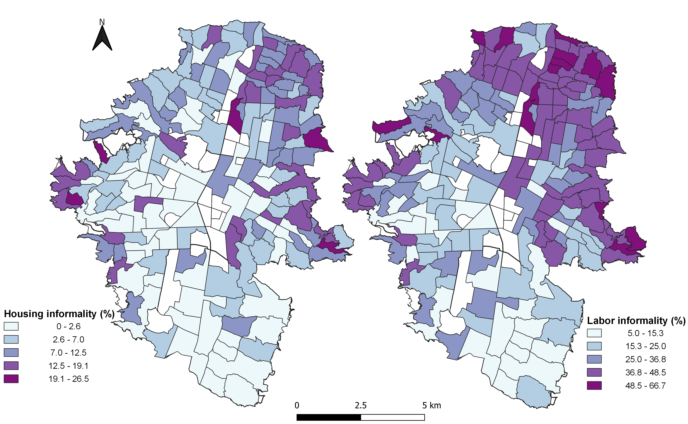
```
---
#  <span style="font-size:80%">Data and descriptive evidence</span>
<spam style="font-size:90%">

<center><spam style="font-size:90%">**Figure 4. Bivariate map of housing informality and labor informality**</center>
```{r, echo=FALSE, out.width="60%",fig.align='center'}
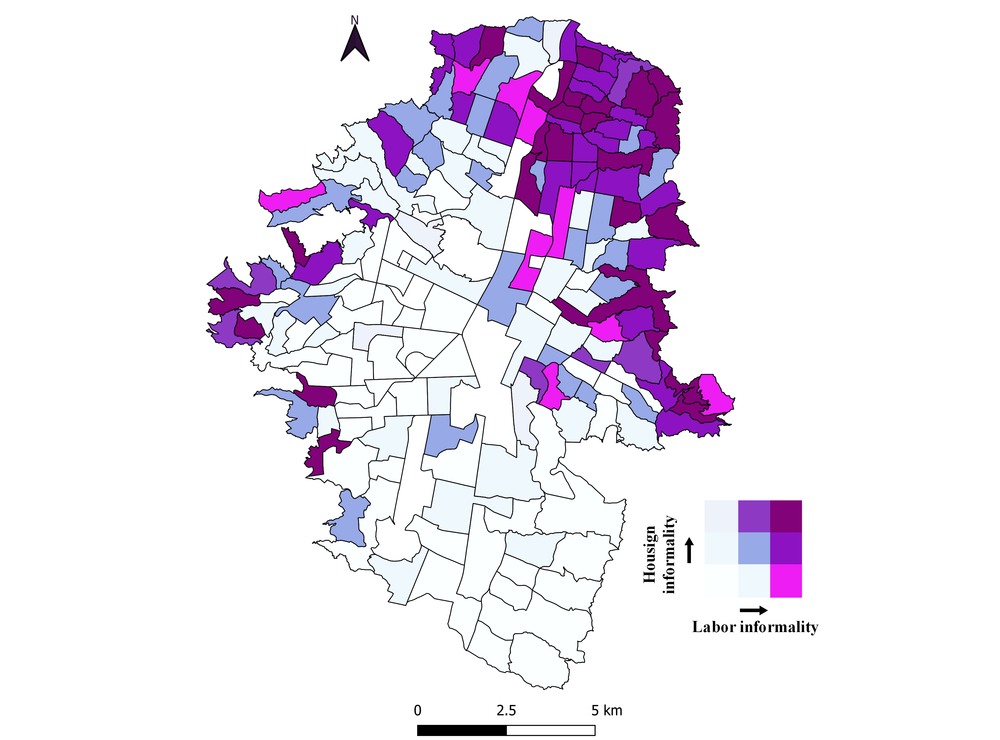
```

---
#  <span style="font-size:80%">Data and descriptive evidence</span>
<spam style="font-size:90%">

**<center><spam style="font-size:90%">Figure 5. Bivariate LISA map of housing informality and labor informality**</center>
```{r, echo=FALSE, out.width="46%",fig.align='center'}
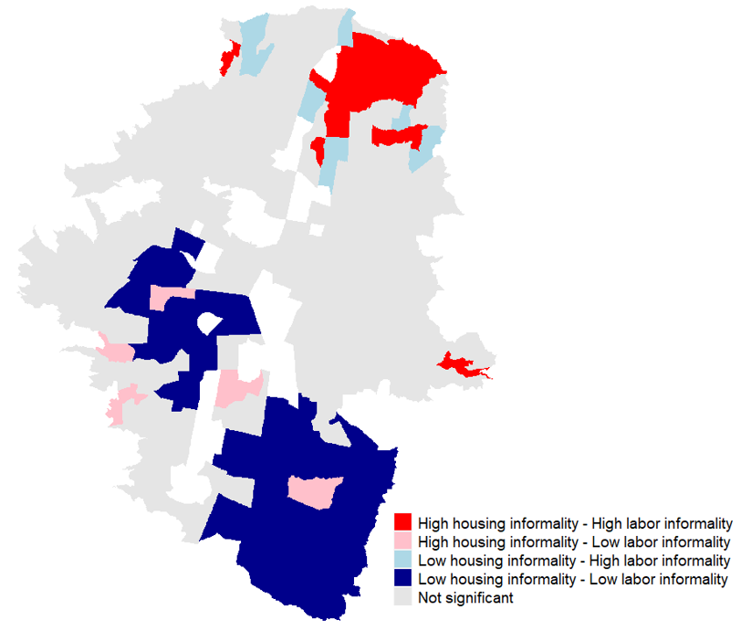
```
<center><spam style="font-size:70%">Note: number of permutations = 999 and significance level at 5%. First-order<br> 
Queen criterion of contiguity was used to calculate the spatial weights</center>

<spam style="font-size:90%">
- Regions with high informal housing present simultaneously high levels of labor informality, in particular in the east, west and north of the city $\Longrightarrow$ <span style="color:blue">urban informality is located in poor peripheral areas and there is a spatial simultaneity between types of informality</span>

- Housing informality and labor informality are phenomena with a <span style="color:blue">high spatial persistence</span>


---
#  <span style="font-size:80%">Data and descriptive evidence</span>
<spam style="font-size:90%">

<center><spam style="font-size:90%">**Figure 6. Spatial distribution of the control variables**
```{r, echo=FALSE, out.width="44%",fig.align='center'}
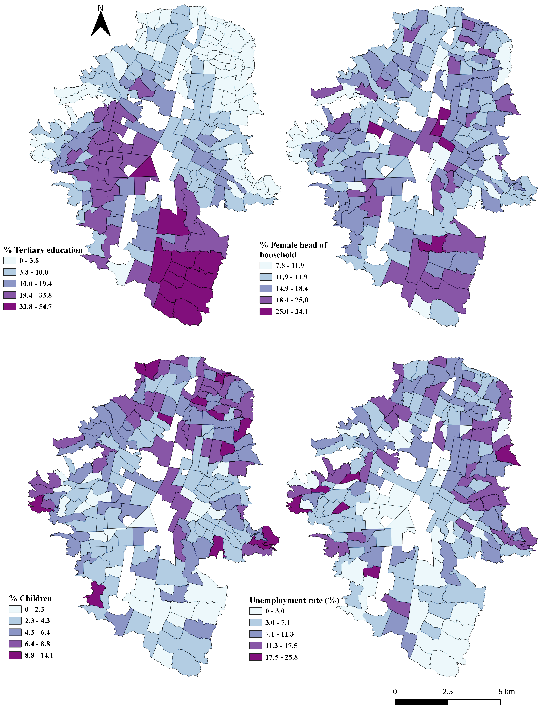
```

---
#  <span style="font-size:80%">Data and descriptive evidence</span>
<spam style="font-size:90%">

```{r, echo=FALSE, out.width="70%",fig.align='center'}
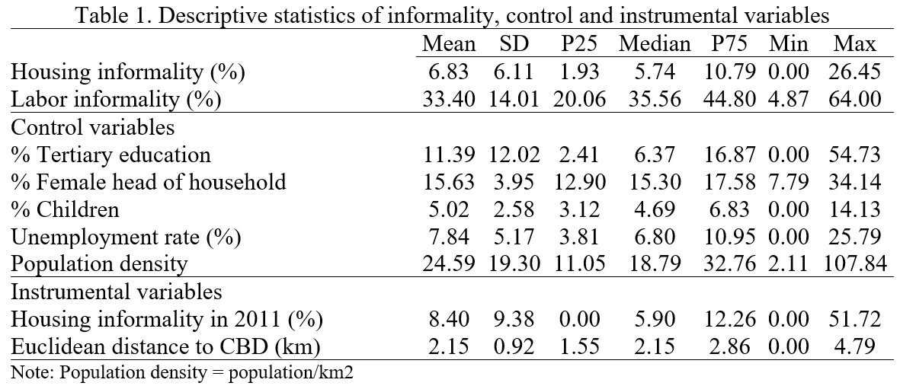
```

---
name: model
# <span style="font-size:80%">Econometric model</span> 
<spam style="font-size:120%">

To measure the relationship between housing informality and labor informality while considering the simultaneity of these two phenomena, we estimate the following system of two equations:


```{r, echo=FALSE, out.width="70%",fig.align='center'}
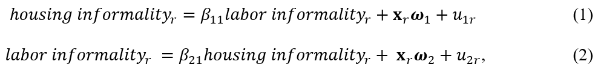
```

Term $\textbf{x}_r$ is a vector of control variables, which includes population with tertiary education, the share of female heads of household, the share of children under six years of age, population density, and the unemployment rate

<span style="color:blue">Our coefficients of interest to estimate are $\beta_{11}$ and $\beta_{21}$, which represent the effect of labor informality on informal housing and vice versa, respectively

---
# <span style="font-size:80%">Econometric model</span> 
<spam style="font-size:120%">

To consider the spatial dimension of housing informality and labor informality, we estimate four types of spatial simultaneous models:

<span style="color:blue">Spatial Lag Model (SLM)</span>
```{r, echo=FALSE, out.width="70%",fig.align='center'}
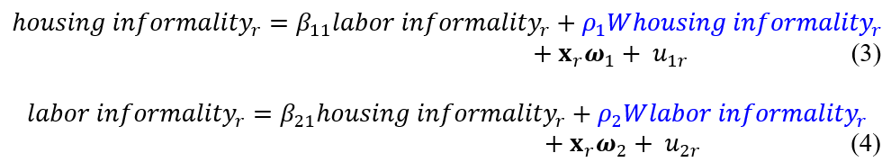
```

<span style="color:blue">Spatial Error Model (SEM)</span>
```{r, echo=FALSE, out.width="70%",fig.align='center'}
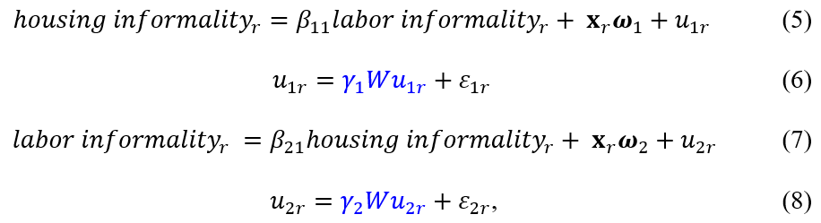
```

<spam style="font-size:90%">Where <span style="color:blue"> $W$</span> is a matrix (r x r) of spatial connectivity among analytical regions, which, in our case, is a standardized first-order Queen type
---
# <span style="font-size:80%">Econometric model</span> 
<spam style="font-size:120%">

<span style="color:blue">Spatial Autoregressive Combined Model (SAC)</span>
```{r, echo=FALSE, out.width="70%",fig.align='center'}
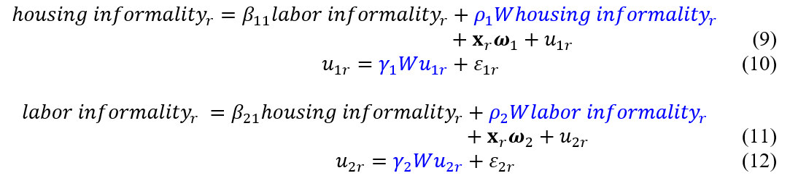
```

<span style="color:blue">Spatial Durbin Model (SDM)</span>
```{r, echo=FALSE, out.width="70%",fig.align='center'}
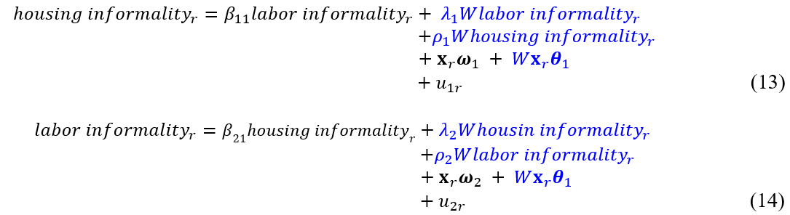
``` 

---
# <span style="font-size:80%">Econometric model</span> 
<spam style="font-size:100%">

Estimating the proposed system of equations may face two problems related to <span style="color:blue">endogeneity</span> (Le Gallo and Fingleton, 2021):

- including endogenous variables as regressors, that is, the inclusion of the dependent variable from the second equation (labor informality) in the first equation and the inclusion of the dependent variable from the first equation (housing informality) in the second equation

- including a spatial lag in the model

To deal with these endogeneity problems, we use an <span style="color:blue">Instrumental Variable (IV) approach:
- we use the Euclidean distance (in km) from the centroids of each analytical region to Medellín’s Central Business District (CBD) as an instrument for the labor informality variable $\Longrightarrow$ <span style="color:blue">spatial mismatch hypothesis</span>

- we use the level of housing informality lagged in time (2011) as an instrument for the current housing informality $\Longrightarrow$ <span style="color:blue">temporal inertia of housing informality 

- endogeneity problem associated with the inclusion of a spatial lag in the models is corrected including spatial lags of a superior order of control variables (Kelejian and Robinson, 1993; Kelejian and Prucha, 1998; Fingleton and Le Gallo, 2008). $\Longrightarrow$ <span style="color:blue">spatial lags of order 2</span> (López et al., 2020)

Another methodological aspect to be considered in estimating the proposed system of spatial simultaneous equations is <span style="color:blue">the presence of cross-equation correlations in the error terms</span> $\Longrightarrow$ <span style="color:blue"> informal transport 

---
# <span style="font-size:80%">Econometric model</span> 
<spam style="font-size:120%">

- In summary, our model is a <span style="color:blue">system of spatial simultaneous equations that allows for correlation between the errors of the equations 

- We use the <span style="color:blue">Generalized Spatial Three-Stage Least Square (GS3SLS) estimator</span> proposed by Kelejian and Prucha (2004) to estimate this model 

- This procedure first corrects the endogeneity problem using a two-stage estimator, namely the GS2SLS method. Then, it considers the relationship between the equations in the system through the stochastic disturbances analogous to a <span style="color:blue">Seemingly Unrelated Regression (SUR)

---
name: results
# <span style="font-size:80%">Results</span> 
<spam style="font-size:85%">

```{r, echo=FALSE, out.width="95%",fig.align='center'}
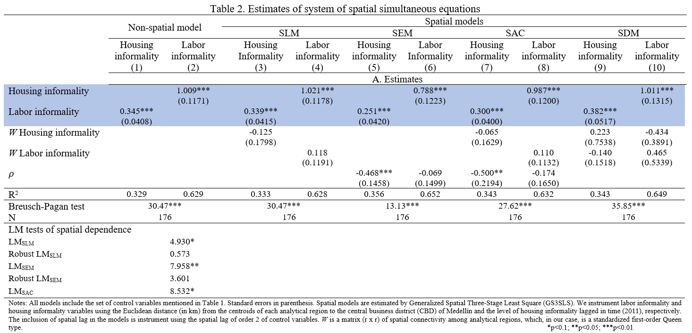
```

- The results for all models consistently indicate that <span style="color:blue">labor informality has a positive and statistically significant effect on informal housing, suggesting that precarious labor conditions are a crucial driver of precarious housing conditions

- <span style="color:blue">The estimates reveal that informal housing positively and significantly affects labor informality

---
# <span style="font-size:80%">Results</span> 
<spam style="font-size:90%">

```{r, echo=FALSE, out.width="80%",fig.align='center'}
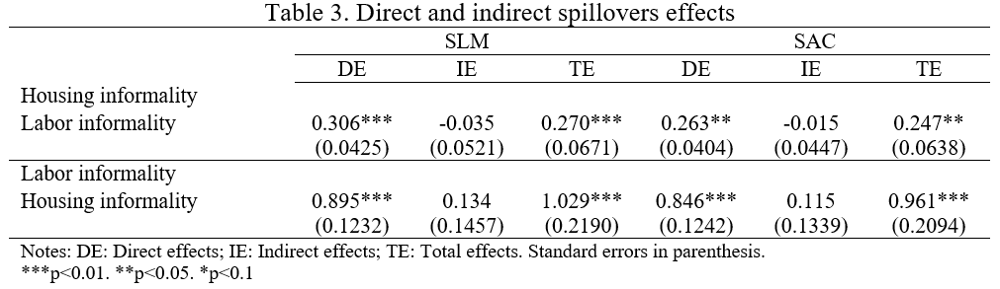
```

- The estimated direct effects of labor informality on informal housing confirm our previous findings that <span style="color:blue">informal work activities are critical to the emergence of informal settlements

- <span style="color:blue">The indirect effect (or spillover effect) of labor informality on informal housing is not statistically significant</span>, indicating that the level of informal housing in one region is not affected by the level of labor informality in neighboring regions 

- <span style="color:blue">This result confirms the highly localized relationship between informal work activities and informal settlements, implying that many poor workers may find shelter and work opportunities within the slum economy 

---
name: conclusions
# <span style="font-size:80%">Conclusions</span>
<spam style="font-size:120%">

- <span style="color:blue">Urban informality is a persistent phenomenon in developing countries</span> and it is an important factor affecting the productivity and wellbeing of cities
    
- In this study we analyze the relationship between informal housing and labor informality at the intra-urban level in Medellín (Colombia), taking into account the spatial dimension of these two phenomena
    
- From a point of view of the location of the urban informality, we found:
<p style="margin-bottom: -1em">
  - Urban informality is located in <span style="color:blue">poor peripheral areas</span>
  - There is a <span style="color:blue">spatial simultaneity</span> between housing informality and labor informality
  - Housing informality and labor informality are phenomena with a <span style="color:blue">high spatial persistence
    
- The estimates of the spatial simultaneous equation models showed that labor informality positively affects housing informality $\Longrightarrow$ <span style="color:blue">precarious labor conditions are important factors that explain the choice of precarious housing
    
- Additionally, there are not spatial spillover effects of labor informality on informal housing $\Longrightarrow$ <span style="color:blue">This may suggest a highly localized relationship between informal housing and labor informality due to the peculiarities of the informal work carried out within homes, leading to precarious housing conditions 

---
<font size = "5">
<center>**<span style="color:#2a326b"><span style= "font-size:110%">Housing informality and labor informality in space**<br>
**<span style="color:#2a326b"><span style= "font-size:100%">In search of the missing links**<br>
**<span style= "font-size:80%">[Gustavo García](https://gusgarciacruz.github.io/cv)**<br>
<span style= "font-size:65%">Universidad EAFIT</center>
<br>
<br>
<br>

#<div class="my-logo-right"></div> 
Slides in [html](https://gusgarciacruz.github.io/Presentations/IEA2023/SlidesIEA2023.html)

Slides in [PDF](https://gusgarciacruz.github.io/Presentations/IEA2023/SlidesIEA2023.pdf)


