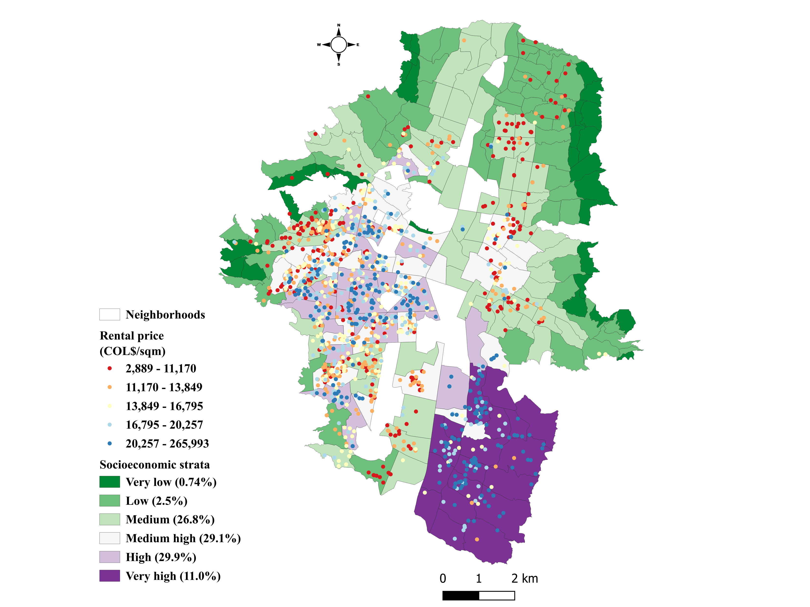
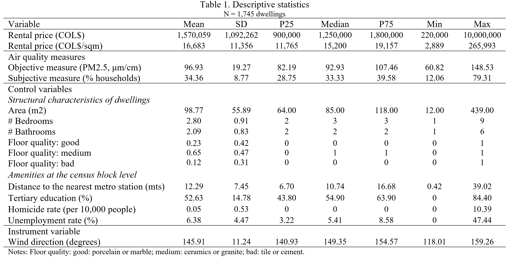
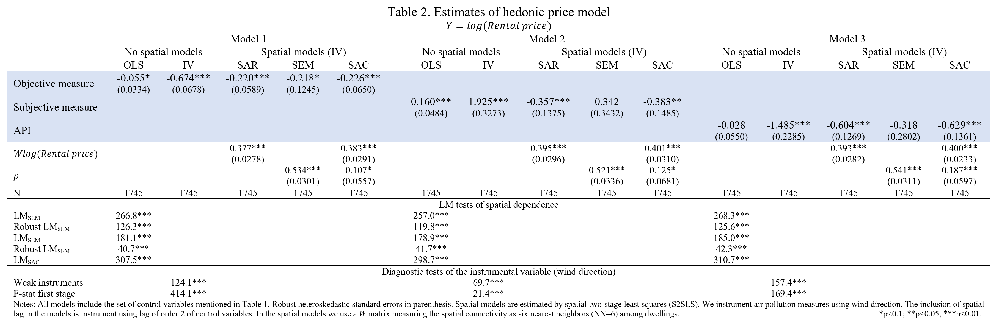
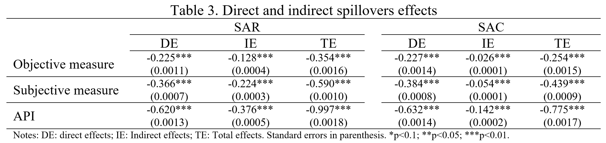

```{r setup, include=FALSE}
# This is the recommended set up for flipbooks
# you might think about setting cache to TRUE as you gain practice --- building flipbooks from scratch can be time consuming
options(width = 70)
knitr::opts_chunk$set(
  dev.args = list(bg = 'transparent'),
  fig.width = 12, message = TRUE,
  warning = FALSE, comment = "", cache = TRUE, fig.retina = 3
)
knitr::opts_knit$set(global.par = TRUE)
Sys.setenv(`_R_S3_METHOD_REGISTRATION_NOTE_OVERWRITES_` = "false")
#remotes::install_github("luukvdmeer/sfnetworks")
#remotes::install_github("EvaMaeRey/flipbookr")
#remotes::install_github("rlesur/klippy")
#devtools::install_github("gadenbuie/xaringanExtra")
library(flipbookr)
library(xaringanthemer)
library(tidyverse)
library(klippy)
library(xaringanExtra)
library(gt); library(knitr); library(kableExtra); library(tibble)
library(summarytools)
```

<style>
.my-logo-right {
    content: "";
    position: absolute;
    left: 400px;
    height: 400px;
    width: 400px;
    background-repeat: no-repeat;
    background-size: contain;
    background-image: url("qr.png");
}

.hbody {
  line-height: .85;
}

body {
  text-align: justify;
}

h1{
  margin-top: -1px;
  margin-bottom: -3px;
}

.small-code pre{
  margin-bottom: -10px;
  
}  

.medium-code pre{
  margin-bottom: 2px;
  
}

</style>

```{r xaringan-scribble, echo=FALSE}
xaringanExtra::use_scribble()
```

```{r xaringanExtra-clipboard, echo=FALSE}
htmltools::tagList(
  xaringanExtra::use_clipboard(
    button_text = "<i class=\"fa fa-clipboard\"></i>",
   success_text = "<i class=\"fa fa-check\" style=\"color: #90BE6D\"></i>",
   error_text = "<i class=\"fa fa-times-circle\" style=\"color: #F94144\"></i>"
 ),
 rmarkdown::html_dependency_font_awesome()
)
```

```{r xaringan-extra-styles, echo=FALSE}
xaringanExtra::use_extra_styles(
  hover_code_line = TRUE,         #<<
  mute_unhighlighted_code = TRUE  #<<
)
```
# <span style="font-size:80%">Outline</span>

- <span style="font-size:150%">[<span style="color:black">Motivation](#motivation)</span> <br>

- <span style="font-size:150%">[<span style="color:black">Contribution](#contribution)</span><br>

- <span style="font-size:150%">[<span style="color:black">Relevant literature](#lite)</span><br>

- <span style="font-size:150%">[<span style="color:black">Data and descriptive evidence](#data)</span><br>

- <span style="font-size:150%">[<span style="color:black">Econometric model](#model)</span><br>

- <span style="font-size:150%">[<span style="color:black">Results](#results)</span><br>

- <span style="font-size:150%">[<span style="color:black">Conclusions](#conclusions)</span>

---
name: motivation
# <span style="font-size:80%">Motivation</span>
<spam style="font-size:105%">

- Agglomeration economies presents important positive externalities (Glaeser, 1998; Duranton and Puga, 2004):
<p style="margin-bottom: -1em">
 - Reduction of transportation costs 
 - higher flow of information
 - Greater specialization and division of labor
 
- Diseconomies of agglomeration are the opposite (Da Schio et al., 2019):
<p style="margin-bottom: -1em">
 - Overcrowding
 - Congestion
 - Ecosystem degradation $\Longrightarrow$ <span style="color:blue">air pollution 
 
- Air pollution has important negative effects on several socioeconomic variables:
<p style="margin-bottom: -1em">
 - Health (Cohen et al., 2017; Wei et al., 2022)
 - Education (Sunyer et al., 2015; Zhang et al., 2018)
 - Labor (Poudyal et al., 2013; He et al., 2019)
 - <span style="color:blue">Housing market</span> (Wang and Lee, 2022; Wang et al., 2022)
 
- Analyzing the effect of air pollution on the housing market is important for several reasons:
<p style="margin-bottom: -1em">
 - Property values: air pollution can negatively impact the desirability of neighborhoods
 - Health impacts: poor air quality is linked to various health issues, which can affect residents' quality of life
 - Urban planning: city planners and policymakers can use this analysis to promote sustainable development
 - Community awareness: highlighting the impact of air pollution on housing can raise public awareness

<span style="color:blue">Overall, understanding how air pollution affects the housing market is crucial for economic stability, public health, and effective urban planning

---
# <span style="font-size:80%">Motivation</span>
<spam style="font-size:120%">

- Research on the effects of air pollution on the housing market is based on the theory of the Hedonic Price Method of Rosen (1974). <span style="color:blue">However, theoretical and empirical research has focused attention on objective measures of pollution, while subjective indicators based on people’s perceptions have received less attention

- Three relevant aspects justify the inclusion of subjective variables to estimate the impact of air quality on real estate markets:
<p style="margin-bottom: -1em">
 - Objective and subjective air quality measures are not strictly related (Berezansky et al., 2010)
 - Neighborhood halo effect (Brody et al., 2004)
 - The importance of subjective variables in assessing the impact of public policies on well-being (Kahneman et al., 1997)

- However, empirical evidence of hedonic pricing model estimates incorporating both objective and subjective indicators of air quality is very limited

---
name: contribution
# <span style="font-size:80%">Contribution</span>
<spam style="font-size:120%">

- This paper contributes to the literature on the effects of environmental amenities on the housing market, <span style="color:blue">including subjective and objective metrics of air quality 

- Our contribution to the literature is twofold:
<p style="margin-bottom: -1em"> 
 - We propose a theoretical model of hedonic price where household preferences are affected by the neighborhood’s perception of air quality
 - We estimate a spatial hedonic model which includes an air quality index which allows for the interaction between objective and subjective measures of air quality

- Using data at the intra-urban level in Medellin (Colombia) on a sample of dwellings, we identified the effect of objective and subjective metrics of air pollution on housing market through <span style="color:blue">spatial hedonic models</span> correcting different possible causes of endogeneity

---
name: lite
# <span style="font-size:80%">Relevant literature</span>
<spam style="font-size:117%">

There are few papers in the literature that estimate spatial hedonic models that incorporate both objective and subjective indicators of air quality

- Chasco and Le Gallo (2013, 2015)
<p style="margin-bottom: -1em">
 - Madrid (Spain)
 - Objective indicator: several types of air pollutants $(SO_2$, $NO_x$, $NO_2$, $CO$, $PM)$
 - Subjective indicator: population’s perception of pollution
 - Spatial quantile and multilevel models
 - housing prices are better explained by subjective evaluation factors than by objective measurements

- Montero et al. (2018) 
<p style="margin-bottom: -1em">
 - Madrid (Spain)
 - Only included subjective indicator: population’s perception of pollution 
 - spatial parametric and semiparametric models
 - strong negative impacts of subjective evaluation of air pollution on housing market, but the characteristics of the neighborhood absorb a large part of the environmental impacts 
 
<span style="color:blue"> This paper aims to offer new evidence on the effects of environmental amenities on the housing market, including subjective and objective metrics of air quality in a spatial hedonic model in the context of a developing-country city

---
name: data
# <span style="font-size:80%">Data and descriptive evidence</span>
<spam style="font-size:100%">

**<span style="color:blue">Study area</span>**: Medellín (Colombia)
<p style="margin-bottom: -1em">
- Population: 2.5 millions (Colombia: 49 millions; Bogotá: 7 millions)
- Area: 380 km2 (Colombia: 1,141,748 km2)
- Density: 6640/km2 (Bogotá: 4531/km2)
- Administrative division: 16 communes and 243 neighborhoods

<center><spam style="font-size:90%">**Figure 1. Study area: Medellín**
```{r, echo=FALSE, out.width="60%",fig.align='center'}
knitr::include_graphics("Figure1.png")
```

---
# <span style="font-size:80%">Data and descriptive evidence</span>
<spam style="font-size:100%">

**<span style="color:blue">Housing market</span>**
<p style="margin-bottom: -1em">
- The data used in this paper came from the Medellín Real Estate Observatory (OIME, *Observatorio Inmobiliario de Medellín*) in 2018
- The database contains information on the rental price, area in square meters, number of rooms, number of bathrooms, number of garages, quality of floors and walls, and location of dwellings
- The sample includes a total of <span style="color:blue">1,745 dwellings</span>, which are distributed in 146 neighborhoods (60% of the urban area of Medellín)
<p style="margin-bottom: -1em">
<center><spam style="font-size:90%">**Figure 2. Spatial distribution of dwellings, rental prices and income categories**
```{r, echo=FALSE, out.width="45%",fig.align='center'}

```


---
# <span style="font-size:80%">Data and descriptive evidence</span>
<spam style="font-size:120%">

**<span style="color:blue">Objective measure of air quality</span>**
<p style="margin-bottom: -1em">
- <span style="color:blue">PM2.5
- The information comes from SIATA (*Sistema de Alerta Temprana de Medellín y el Valle de Aburrá*) $\Longrightarrow$ 10 monitoring stations
- The average of the daily maximum for the worst quarter in 2017 (Anselin and Lozano-Gracia, 2008)
- Ordinary Krigin interpolation (Anselin and Le Gallo, 2007)
 
**<span style="color:blue">Subjective measure of air quality</span>**
<p style="margin-bottom: -1em">
- <span style="color:blue">Proportion of households in the neighborhood that consider air quality to be poor or
very poor (Chasco and Le Gallo, 2013, 2015)
- The data used came from the Quality of Life Survey for Medellín in 2017 (ECV, *Encuesta de Calidad de Vida*). The sample includes a total of 42,806 individuals (12,205 households)

**<span style="color:blue">Air Pollution Index (API)</span>**
<p style="margin-bottom: -1em">
- API captures the interaction between the objective and subjective air quality variables
- <span style="color:blue">Simple average between the objective and subjective air quality indicators (previously, the variables were scaled between 0 and 1)

---
# <span style="font-size:80%">Data and descriptive evidence</span>
<spam style="font-size:90%">

<center><spam style="font-size:90%">**Figure 3. Measures of air quality and housing rental prices**</center>
<p style="margin-bottom: -1em">
<spam style="font-size:80%"> $\hspace{90mm}$A. Objective measure    $\hspace{35mm}$ B. Subjective measure
```{r, echo=FALSE, out.width="54%",fig.align='center'}
knitr::include_graphics("Figure3.png")
```

- The spatial distribution of air pollution shows that:
<p style="margin-bottom: -1em">
 - $\Uparrow$ <span style="color:blue">objective measure</span> $\Longrightarrow$ <span style="color:blue">northeast</span> of the city 
 - $\Uparrow$ <span style="color:blue">subjective measure</span> $\Longrightarrow$ <span style="color:blue">center</span> of the city
 - <span style="color:blue">spatial differences between objective and subjective measures </span> $\Longrightarrow$ $corr(\text{PM2.5},\text{perceived})=0.06, \text{Pvalor}=0.02$
- The spatial relationship between <span style="color:blue">air pollution</span> and <span style="color:blue">housing rental prices</span> shows that:
 - there is an important <span style="color:blue">heterogeneity
 - <span style="color:blue">areas with high rental housing values (*El Poblado* and *Laureles*) present low levels of air pollution (both, PM2.5 and perceived)

---
# <span style="font-size:80%">Data and descriptive evidence</span>
<spam style="font-size:120%">

```{r, echo=FALSE, out.width="90%",fig.align='center'}

```

---
name: model
# <span style="font-size:80%">Econometric model</span>
<spam style="font-size:120%">

The hedonic price model to be estimated is as follows:

$$ log(Rental \text{ } price_i) = \alpha + \color{blue}{\beta AP_i} + \textbf{S}_i' \boldsymbol{\omega}_1 + \textbf{N}_j' \boldsymbol{\omega}_2 + u_i$$

$Rental \text{ } price_i$: housing rental price of dwelling $i$<br>
<span style="color:blue"> $AP_i$: air pollution measure in dwelling $i$: objective measure, subjetive measure or API</span><br>
$\textbf{S}_i$: a matrix of structural characteristics of each dwelling $i$<br>
$\textbf{N}_j$: a matrix of amenities in each census block $j$<br>
$\boldsymbol{\omega}_1,\boldsymbol{\omega}_2$: vectors of coeffecients to estimate<br>
$u_i$: error term

<span style="color:blue">Our coefficient of interest to estimate is $\beta$, which represent the effect of air pollution on the housing market

---
# <span style="font-size:80%">Econometric model</span>
<spam style="font-size:120%">

To account for spatial dependence in the hedonic price model, we estimate three types of spatial models: 

<span style="color:blue">Spatial Lag Model (SLM)</span>
$$ log(Rental \text{ } price_i) = \alpha + \beta AP_i + \textbf{S}_i' \boldsymbol{\omega}_1 + \textbf{N}_j' \boldsymbol{\omega}_2 + \color{blue}{\gamma W Rental \text{ } price_i} +u_i$$

<span style="color:blue">Spatial Error Model (SEM)</span>
$$ log(Rental \text{ } price_i) = \alpha + \beta AP_i + \textbf{S}_i' \boldsymbol{\omega}_1 + \textbf{N}_j' \boldsymbol{\omega}_2 +u_i$$
$$u_i = \color{blue}{\rho W u_i} + \epsilon_i$$
<span style="color:blue">Spatial Autoregressive Combined Model (SAC)</span>
$$ log(Rental \text{ } price_i) = \alpha + \beta AP_i + \textbf{S}_i' \boldsymbol{\omega}_1 + \textbf{N}_j' \boldsymbol{\omega}_2 + \color{blue}{\gamma W Rental \text{ } price_i} +u_i$$
$$u_i = \color{blue}{\rho W u_i} + \epsilon_i$$

<spam style="font-size:90%">Where <span style="color:blue"> $W$</span> is a matrix $(i \text{ x } i)$ of spatial connectivity among dwellings, which is measured as six nearest neighbors (NN=6)

---
# <span style="font-size:80%">Econometric model</span>
<spam style="font-size:120%">

Estimating the proposed hedonic model may face two problems related to <span style="color:blue">endogeneity</span> due to (Anselin, 1988; Anselin and Lozano-Gracia, 2009):
<p style="margin-bottom: -1em">
- measurement errors in contamination levels by the interpolation and subjective responses

- the inclusion of spatially lagged dependent variable $(W Rental \text{ } price_i)$

To deal with these endogeneity problems, we use an <span style="color:blue">Instrumental Variable (IV) approach</span> (Chay and Greenstone, 2005; Bayer et al, 2006; Lee, 2006):
<p style="margin-bottom: -1em">
- we use the wind direction as an instrument for the measures of air pollution $\Longrightarrow$ <span style="color:blue">air pollutions is affected by meteorological factors</span> (Deryugina et al., 2019; Bondy et al., 2020; Carneiro et al., 2021; Jon et al., 2023)

- endogeneity problem associated with the inclusion of a spatial lag in the models is corrected including spatial lags of a superior order of control variables (Kelejian and Robinson, 1993; Kelejian and Prucha, 1998; Fingleton and Le Gallo, 2008). $\Longrightarrow$ <span style="color:blue">spatial lags of order 2</span> (López et al., 2020)

We use <span style="color:blue">spatial two-stage least squares (S2SLS)</span> to estimate the models and use a robust heteroskedastic estimator to correct standard errors
 
---
name: results
# <span style="font-size:80%">Results</span> 
<spam style="font-size:100%">

```{r, echo=FALSE, out.width="200%",fig.align='center'}

```

- In general, <span style="color:blue">the results show that air pollution present a negative and significant effect on housing rental price

- When spatial dependence is consider in different structures, <span style="color:blue">subjective air pollution measure shows a larger negative effect on housing market compared to the effect of objective metric</span>, and the magnitude of the effect is amplified with the interaction of the subjective and objective variables 

---
# <span style="font-size:80%">Results</span> 
<spam style="font-size:100%">

```{r, echo=FALSE, out.width="80%",fig.align='center'}

```

- The estimated direct effects of air pollution on housing market confirm our previous findings that <span style="color:blue">housing rental prices are more affected by subjective evaluation factors than by objective measurements

- <span style="color:blue">The indirect effect (or spillover effect) of air pollution on housing rental prices is also negative and statistically significant</span>, indicating that the rental price of one dwelling is affected by the level of air pollution of neighboring dwelling 

- These results confirm that housing decisions are <span style="color:blue">subject to perceptions of place</span> and it is important to consider the <span style="color:blue">spillover effects of air pollution on housing market 

---
name: conclusions
# <span style="font-size:80%">Conclusions</span>
<spam style="font-size:120%">

---
<font size = "5">
<center>**<span style="color:#2a326b"><span style= "font-size:110%">Housing market impacts of air pollution**<br>
**<span style="color:#2a326b"><span style= "font-size:100%">Do objective or subjective measures of air quality matter?**<br>
**<span style= "font-size:80%">[Gustavo García](https://gusgarciacruz.github.io/cv)**<br>
<span style= "font-size:65%">Universidad EAFIT</center>
<br>
<br>
<br>

#<div class="my-logo-right"></div> 
Slides in [html](https://gusgarciacruz.github.io/Presentations/IEA2023/SlidesIEA2023.html)

Slides in [PDF](https://gusgarciacruz.github.io/Presentations/IEA2023/SlidesIEA2023.pdf)

